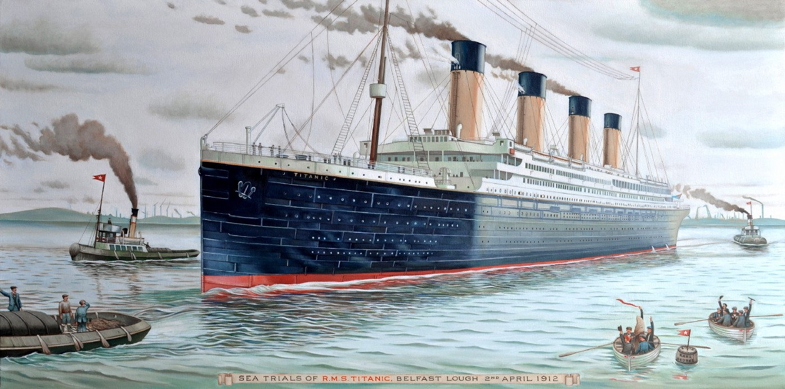

Limpieza y análisis del *dataset* TITANIC
---

[*Sea Trials of RMS Titanic*](https://upload.wikimedia.org/wikipedia/commons/d/d7/Sea_Trials_of_RMS_Titanic%2C_2nd_of_April_1912.jpg), de Wikipedia

### Análisis de la supervivencia a bordo del Titanic

El objetivo de este respositorio es realizar una limpieza y análisis del [*dataset* Titanic](https://www.kaggle.com/c/titanic/data), cuyo objetivo primordial es la creación de un modelo que prediga que pasajeros sobrevivieron al hundimiento del Titanic y cuales son las variables más importantes para la predicción.

Este *dataset* resulta especialmente atractivo por lo interesante del tema, 
la variedad en las variables y la cantidad de estudios y discusiones sobre él que podemos encontrar, 
incluso en la propia [página de discusiones de la competición en Kaggle](https://www.kaggle.com/c/titanic/discussion). 

### Organización del repositorio

La organización del repositorio es como sigue:

+ **Fichero README.md:** fichero actual con información genérica del repositorio.
+ **Carpeta *source*:** carpeta con el código original en formato RMarkdown (.rmd) y los documentos de salida en diferentes formatos: pdf, html y markdown. 
+ **Capeta *data*:** carpeta con los dos conjuntos de datos originales tal y como los podemos descargar de *Kaggle* (train.csv y test.csv) y también limpios, después del procesamiento (train_clean.csv y test_clean.csv).
