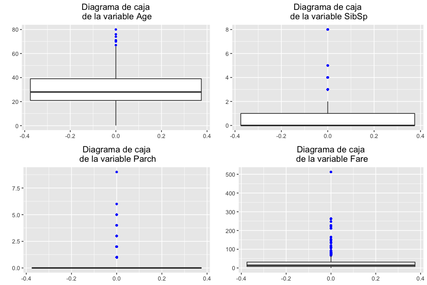
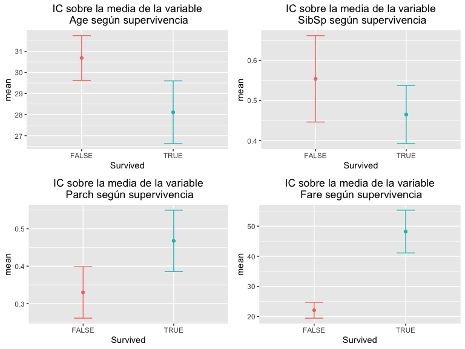
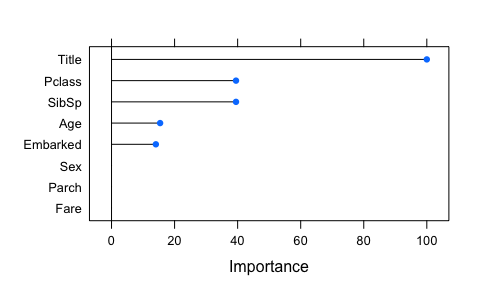
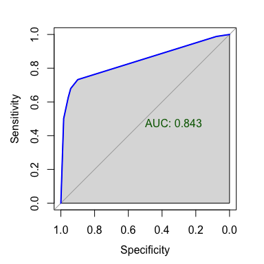

# 1. Descripción del dataset

El conjunto de datos que estudiaremos es el [*Titanic dataset*](https://www.kaggle.com/c/titanic/data). 
El objetivo primordial de este *dataset* es la creación de un modelo que prediga que pasajeros sobrevivieron al hundimiento del Titanic y cuales son las variables más importantes para la predicción.

Este *dataset* resulta especialmente atractivo por lo interesante del tema, 
la variedad en las variables y la cantidad de estudios y discusiones sobre él que podemos encontrar, 
incluso en la propia [página de discusiones de la competición en Kaggle](https://www.kaggle.com/c/titanic/discussion). 

El conjunto de datos "completo" tal y como se incluye en [Kaggle](https://www.kaggle.com) viene ya dividido en dos subconjuntos: 
uno de entrenamiento, denominado "train.csv" y otro de evaluación, denominado "test.csv".
Al conjunto de evaluación le falta la columna `Survived` que se debe predecir.
Esto se debe a que sobre este segundo conjunto está pensado para que efectuemos nuestras predicciones sobre él y subamos estas predicciones a la [competición](https://www.kaggle.com/c/titanic/overview) a la que pertenece.
En consecuencia nosotros preprocesaremos ambos conjuntos, 
pero sólo podremos utilizar el primer conjunto para analizar, 
aunque mantendremos la nomenclatura (conjunto de entrenamiento y de evaluación) original.

La hoja de ruta es la siguiente:

a. Limpiaremos ambos conjuntos de datos de manera conjunta, 
pero distinguiendo el subconjunto a la hora de hacer inputaciones. 

b. Analizaremos el conjunto de entrenamiento. 

c. Crearemos también un modelo de clasificación con el conjunto de entrenamiento, 
y usaremos la validación cruzada para evaluar su rendimiento. 

d. Obtendremos las variables más importantes para la predicción a partir de este último modelo.

El conjunto contiene 10 variables además de la variable respuesta `survived`, 
con 891 registros en el conjunto de entrenamiento y 418 registros en el conjunto de evaluación.

A continuación mostramos el diccionario de datos:

| Variable  | Definición    | Claves    |
|-----------|---------------|-----------|
| survival  | Variable binaría indicadora de la supervivencia.   | 1 = Sí, 0 = No.
| pclass    | Clase del billete de embarque.  | 1&nbsp;=&nbsp;Primera clase, 2&nbsp;=&nbsp;Segunda clase, 3&nbsp;=&nbsp;Tercera clase
| sex       | Sexo.   |
| Age       | Edad, en años.              |
|sibsp|Número de hermanos/esposas también en el Titanic.|
|parch|Número de padres/hijos también en el Titanic.|
|ticket|Código alfanumérico del billete.|
|fare| Precio del billete. |
|cabin| Código alfanumérico de cabina. |
|embarked| Puerto de embarque. | C = Cherbourg, Q&nbsp;=&nbsp;Queenstown, S&nbsp;=&nbsp;Southampton

# 2. Integración y selección de los datos de interés a analizar.

Como primer paso de la integración unimos ambos conjuntos de datos 
entrenamiento y evaluación en uno sólo, 
sobre el cual efectuaremos la limpieza. 
Dado que los ficheros originales los guardaremos inalterados no hace falta identificar de que fichero viene cada registro, 
por lo que los podemos fundir de manera vertical tras definir la columna `survived` como `NA` en el conjunto de evaluación:


```r
train_df <- read.csv("data/train.csv")
test_df <- read.csv("data/test.csv")
test_df['Survived'] = NA
df = rbind(train_df, test_df)
```

Verificamos la unicidad de los atributos individuales del conjunto unificado, 
es decir todos los atributos excepto el identificador. 
Como podemos ver todos los registros son únicos:


```r
any(duplicated(df[,-1]))
```

```
## [1] FALSE
```

Respecto a la selección de datos:

+ Como no nos interesa restringirnos a un grupo en particular mantendremos en este punto todos los registros. 

+ Nos quedaremos también todas las variables, 
dado que todas parece que puedan estar relacionadas con el objetivo, 
y eliminaremos las que no nos sean útiles más adelante en un proceso de selección de variables.

# 3. Limpieza de datos

## 3.1 Busqueda de valores nulos

Como primer punto de la limpieza de datos y de cara a identificar los valores desconocidos que pueda haber no identificados como tales (como `NA`), 
analizaremos la estructura del conjunto de datos, 
haremos las conversiones de variables necesarias 
y obtendremos una descripción preliminar de los datos. 

La estructura de los datos tal y como los ha leido `R` es como sigue:

```r
str(df)
```

```
## 'data.frame':	1309 obs. of  12 variables:
##  $ PassengerId: int  1 2 3 4 5 6 7 8 9 10 ...
##  $ Survived   : int  0 1 1 1 0 0 0 0 1 1 ...
##  $ Pclass     : int  3 1 3 1 3 3 1 3 3 2 ...
##  $ Name       : chr  "Braund, Mr. Owen Harris" "Cumings, Mrs. John Bradley (Florence Briggs Thayer)" "Heikkinen, Miss. Laina" "Futrelle, Mrs. Jacques Heath (Lily May Peel)" ...
##  $ Sex        : chr  "male" "female" "female" "female" ...
##  $ Age        : num  22 38 26 35 35 NA 54 2 27 14 ...
##  $ SibSp      : int  1 1 0 1 0 0 0 3 0 1 ...
##  $ Parch      : int  0 0 0 0 0 0 0 1 2 0 ...
##  $ Ticket     : chr  "A/5 21171" "PC 17599" "STON/O2. 3101282" "113803" ...
##  $ Fare       : num  7.25 71.28 7.92 53.1 8.05 ...
##  $ Cabin      : chr  "" "C85" "" "C123" ...
##  $ Embarked   : chr  "S" "C" "S" "S" ...
```

Como podemos ver hay muchas variables cuyo tipo debemos cambiar: 

+ `Survived`, `Sex` y `Cabin` (dado que mucha gente comparte cabina), y `Embarked` deberían ser factores.

+ `Ticket` también debería ser un factor, dado que no es único, 
si no que hay pasajeros que comparten un mismo ticket (y no es porque sean `NA`o `''`):


```r
table(duplicated(df['Ticket']))
```

```
## 
## FALSE  TRUE 
##   929   380
```

```r
head(df[duplicated(df['Ticket']), c('Ticket')])
```

```
## [1] "349909"       "CA 2144"      "19950"        "11668"        "347082"      
## [6] "S.O.C. 14879"
```

+ `Pclass` debería ser un factor ordenado donde el nivel más bajo fuese 3 y el más alto 1.

+ `SibSp` y `Parch` deberían ser enteros, si bien este cambio no suele impactar demasiado en los análisis.

Mantendremos `PassengerId` como número, 
siendo conscientes de que es en realidad la clave primaria de nuestros datos.

Hacemos las conversiones necesarias:


```r
df[,"Survived"] = factor(df[,"Survived"],
                         levels = c(0,1),
                         labels = c(FALSE, TRUE))
df[, c('Sex', 'Ticket', 'Cabin', 'Embarked')] = 
  lapply(df[, c('Sex', 'Ticket', 'Cabin', 'Embarked')], factor)
df[, 'Pclass'] = factor(df[,'Pclass'], ordered = TRUE, levels = c(3,2,1))
df[, c('SibSp', 'Parch')] = lapply(df[, c('SibSp', 'Parch')], as.integer)
```

Analizamos ahora por encima los datos que tenemos según su tipo.

Comenzamos por las variables numéricas:


```r
summary(Filter(is.numeric, df))
```

```
##   PassengerId        Age            SibSp            Parch      
##  Min.   :   1   Min.   : 0.17   Min.   :0.0000   Min.   :0.000  
##  1st Qu.: 328   1st Qu.:21.00   1st Qu.:0.0000   1st Qu.:0.000  
##  Median : 655   Median :28.00   Median :0.0000   Median :0.000  
##  Mean   : 655   Mean   :29.88   Mean   :0.4989   Mean   :0.385  
##  3rd Qu.: 982   3rd Qu.:39.00   3rd Qu.:1.0000   3rd Qu.:0.000  
##  Max.   :1309   Max.   :80.00   Max.   :8.0000   Max.   :9.000  
##                 NA's   :263                                     
##       Fare        
##  Min.   :  0.000  
##  1st Qu.:  7.896  
##  Median : 14.454  
##  Mean   : 33.295  
##  3rd Qu.: 31.275  
##  Max.   :512.329  
##  NA's   :1
```

Podemos ver que sólo a un registro le falta información de `Fare`. 
Por otra parte también vemos que 263 registros no tienen la edad informada.
Esto sí que es un posible problema que necesitaremos subsanar, 
dado que una posible política de supervivencia prioritaria aplicada durante el hundimiento del Titanic podría ser "Mujeres y niños primero".
Del resto de variables sólo la cantidad de ceros en `Parch` nos hace pensar que puedan ser valores desconocidos, 
pero teniendo en cuenta el significado de la variable parece normal.

Estudiamos también los factores:


```r
summary(Filter(is.factor, df))
```

```
##   Survived   Pclass      Sex           Ticket                 Cabin     
##  FALSE:549   3:709   female:466   CA. 2343:  11                  :1014  
##  TRUE :342   2:277   male  :843   1601    :   8   C23 C25 C27    :   6  
##  NA's :418   1:323                CA 2144 :   8   B57 B59 B63 B66:   5  
##                                   3101295 :   7   G6             :   5  
##                                   347077  :   7   B96 B98        :   4  
##                                   347082  :   7   C22 C26        :   4  
##                                   (Other) :1261   (Other)        : 271  
##  Embarked
##   :  2   
##  C:270   
##  Q:123   
##  S:914   
##          
##          
## 
```

Vemos por una parte los 418 valores desconocidos que ya conocíamos en la variable `Survived`. 
También vemos dos valores `NA` encubiertos en las variables `Cabin` y `Embarked` que convertimos en `NA`, tras lo cual eliminamos el nivel que les corresponde:


```r
# Cabin
df[df['Cabin']=='', 'Cabin']  = NA
df[,'Cabin'] = droplevels(df[,'Cabin'])
# Embarked
df[df['Embarked']=='', 'Embarked']  = NA
df[,'Embarked'] = droplevels(df[,'Embarked'])
```

## 3.2 Reconocimiento de valores extremos

Estudiamos ahora los posibles valores extremos que pueda haber en el conjunto de datos. 
Realizamos para ello un diagrama de caja de cada una de las variables numéricas con la librería `ggplot2`:


```r
library(ggplot2)
PrettyBoxplot= function(var){
  bp = ggplot(df, aes(y = get(var))) + 
    geom_boxplot(outlier.colour="blue", outlier.size = 1) + 
    ggtitle(paste("Boxplot de la variable", var)) + ylab("") +
    theme(plot.title = element_text(hjust = 0.5))
  return(bp)
}
gridExtra::grid.arrange(grobs = lapply(colnames(Filter(is.numeric, df[,-1])), PrettyBoxplot))
```



### Variable `Age`

El diagrama de caja de la variable `Age` muestra que hubo personas de edad avanzada en el Titanic, pero no muestra ningún valor que pudiese considerarse extremo.

### Variable `SibSp`

El diagrama de caja de la variable `SibSp` muestra que el 75% de los embarcados en el Titanic venían solos o acompañados de un sólo hermano o hermana. 
Como consecuencia todos los valores más grandes que 3 son numéricamente valores extremos. 
Para identificar si realmente son valores erróneos que debemos tratar podemos estudiar cuanta gente con más de 3 hermanos comparte el mismo apellido:


```r
# Filtramos los valores extremos
ManySiblings = df[df['SibSp']>3,]
# Obtenemos el apellido
ManySiblings[, 'Surname'] = sapply(ManySiblings[, 'Name'],
                                   function(x){strsplit(x, ",")[[1]][1]})
# Obtenemos la tabla:
table(ManySiblings[,c('SibSp', 'Surname')])
```

```
##      Surname
## SibSp Andersson Asplund Goodwin Panula Rice Sage
##     4         7       5       0      5    5    0
##     5         0       0       6      0    0    0
##     8         0       0       0      0    0    9
```
Como podemos ver en todos los grupos excepto en el de los apellidados Andersson hay $n+1$ hermanos, donde $n$ es el número de hermanos índicados por todos ellos. Consideramos por lo tanto que todos estos valores son correctos.
Estudiamos con más detalle la familia la familia Andersson:


```r
ManySiblings[ManySiblings['Surname']=='Andersson',]
```

<div class="kable-table">

|     | PassengerId|Survived |Pclass |Name                                    |Sex    | Age| SibSp| Parch|Ticket  |   Fare|Cabin |Embarked |Surname   |
|:----|-----------:|:--------|:------|:---------------------------------------|:------|---:|-----:|-----:|:-------|------:|:-----|:--------|:---------|
|69   |          69|TRUE     |3      |Andersson, Miss. Erna Alexandra         |female |  17|     4|     2|3101281 |  7.925|NA    |S        |Andersson |
|120  |         120|FALSE    |3      |Andersson, Miss. Ellis Anna Maria       |female |   2|     4|     2|347082  | 31.275|NA    |S        |Andersson |
|542  |         542|FALSE    |3      |Andersson, Miss. Ingeborg Constanzia    |female |   9|     4|     2|347082  | 31.275|NA    |S        |Andersson |
|543  |         543|FALSE    |3      |Andersson, Miss. Sigrid Elisabeth       |female |  11|     4|     2|347082  | 31.275|NA    |S        |Andersson |
|814  |         814|FALSE    |3      |Andersson, Miss. Ebba Iris Alfrida      |female |   6|     4|     2|347082  | 31.275|NA    |S        |Andersson |
|851  |         851|FALSE    |3      |Andersson, Master. Sigvard Harald Elias |male   |   4|     4|     2|347082  | 31.275|NA    |S        |Andersson |
|1106 |        1106|NA       |3      |Andersson, Miss. Ida Augusta Margareta  |female |  38|     4|     2|347091  |  7.775|NA    |S        |Andersson |

</div>

Como podemos ver hay dos registros que destacan por edad y por ticket, 
los registros 69 y 1106, y que además no están casadas, como indica el título 'Miss.'.
Consideramos por lo tanto que el atributo `SibSp` de estos dos registros es erróneo, y lo convertimos a `NA`:


```r
df[c(69, 1106), 'SibSp'] = NA
```

### Variable `Parch`

El diagrama de caja de la variable `Parch` muestra que numéricamente todos los valores no cero son valores extremos. 
Estudiamos más en detalle aquellos registros con más de 4 descendientes en el Titanic, 
y vemos si lo podemos corresponder con las familias de hermanos recién identificadas:


```r
# Filtramos los valores extremos
ManyDescendants = df[df['Parch']>4,]
# Obtenemos el apellido
ManyDescendants[, 'Surname'] = sapply(ManyDescendants[, 'Name'],
                                      function(x){strsplit(x, ",")[[1]][1]})
# Obtenemos la tabla:
table(ManyDescendants[,c('Parch', 'Surname')])
```

```
##      Surname
## Parch Andersson Asplund Goodwin Panula Rice Sage
##     5         2       2       0      1    1    0
##     6         0       0       2      0    0    0
##     9         0       0       0      0    0    2
```
Como podemos ver se corresponde perfectamente con las familias identificadas previamente, 
una vez corregidas los dos registros 'Andersson' erróneos, 
por lo que no son realmente valores extremos.

### Variable `Fare`

En el diagrama de la variable `Fare` vemos que hay muchos valores que numéricamente son valores extremos 
En este caso nos limitamos a verificar que todos los registros con tarifa muy elevada son de primera clase:


```r
all(na.omit(df[df['Fare']>200,'Pclass'] == 1))
```

```
## [1] TRUE
```

Hemos utilizado la función `na.omit()` debido al registro con `Fare` desconocido que ya conocemos. 
Vemos que obviado este valor todos los registros corresponden efectivamente a personas que viajaron en primera clase, por lo que damos los valores de `Fare` por válidos.

## 3.3 Tratamiento de valores nulos

Recapitulando tenemos que tratar

+ 263 valores perdidos en la variable `Age`,

+ 2 valores perdidos en la variable `SibSp`

+ 1 valor perdido en la varaible `Fare`,

+ 1014 valores perdidos en la variable `Cabin`, y

+ 2 valores perdidos en la variable `Embarked`. 

Es importante notar que todas las medidas que tomemos en este apartado para tratar los valores perdidos deberán tener en cuenta a que subconjunto pertenece cada registro.
El motivo es que de lo contrario podríamos estar filtrando información sobre datos de evaluación al modelo,
si por ejemplo utilizasemos el conjunto completo para inputar un valor en un registro de entrenamiento.

### Variable `Cabin`

El caso de la variable `Cabin` es el más claro:
tanto la variedad de la variable como la cantidad de registros perdidos (casi 3/4)
nos obligan a eliminarla de ambos subconjuntos:


```r
df = df[, names(df) != 'Cabin']
```

Hecho esto resulta interesante estudiar las posibles combinaciones de valores desconocidos, 
dado que esto dificultara las posibles inputaciones que queramos hacer.
Afortunadamente no hay registros con más de un `NA`:


```r
VIM::aggr(Filter(anyNA, df[,-2]), combine = TRUE, bars = FALSE)
```


### Variable `Embarked`

Observemos los registros:


```r
df[is.na(df['Embarked']),]
```

<div class="kable-table">

|    | PassengerId|Survived |Pclass |Name                                      |Sex    | Age| SibSp| Parch|Ticket | Fare|Embarked |
|:---|-----------:|:--------|:------|:-----------------------------------------|:------|---:|-----:|-----:|:------|----:|:--------|
|62  |          62|TRUE     |1      |Icard, Miss. Amelie                       |female |  38|     0|     0|113572 |   80|NA       |
|830 |         830|TRUE     |1      |Stone, Mrs. George Nelson (Martha Evelyn) |female |  62|     0|     0|113572 |   80|NA       |

</div>

Vemos que ambos pertenecen al subconjunto de entrenamiento (dado que tienen la variable `Survived` informada).
También vemos que compartían ticket, pero nadie más lo compartia con ellas:


```r
df[df['Ticket'] == 113572,]
```

<div class="kable-table">

|    | PassengerId|Survived |Pclass |Name                                      |Sex    | Age| SibSp| Parch|Ticket | Fare|Embarked |
|:---|-----------:|:--------|:------|:-----------------------------------------|:------|---:|-----:|-----:|:------|----:|:--------|
|62  |          62|TRUE     |1      |Icard, Miss. Amelie                       |female |  38|     0|     0|113572 |   80|NA       |
|830 |         830|TRUE     |1      |Stone, Mrs. George Nelson (Martha Evelyn) |female |  62|     0|     0|113572 |   80|NA       |

</div>

Como no tenían familia a bordo tampoco parece que utilizar sus apellidos vaya a ser una buena opción, 
por lo que decidimos descartar ambos registros:


```r
df = df[-c(62, 830),]
```

### Variable `Fare`

Observemos el registro:


```r
df[is.na(df['Fare']),]
```

<div class="kable-table">

|     | PassengerId|Survived |Pclass |Name               |Sex  |  Age| SibSp| Parch|Ticket | Fare|Embarked |
|:----|-----------:|:--------|:------|:------------------|:----|----:|-----:|-----:|:------|----:|:--------|
|1044 |        1044|NA       |3      |Storey, Mr. Thomas |male | 60.5|     0|     0|3701   |   NA|S        |

</div>

Notamos que en este caso el registro correspondende al subconjunto de evaluación.
Como el registro pertenece a la tercera clase y no tiene familia embarcada le inputamos la media de tarifas de este subgrupo dentro del subconjunto de evaluación:


```r
df[is.na(df['Fare']),'Fare']= 
  mean(df[df['Pclass'] == 3 & df['SibSp'] == 0 & df['Parch'] == 0 & is.na(df['Survived']),
          'Fare'], na.rm = TRUE)
```

### Variable `Age`

Finalmente llegamos a la variable más complicada, `Age`. 
El número de registros sin edad informada hace inviable eliminarlos todos, 
por lo que lo más sensato parece tratar de inputarles valores.
Utilizaremos para ello una estrategia parecida a la utilizada en [este tutorial de Kaggle](https://www.kaggle.com/allohvk/titanic-missing-age-imputation-tutorial-advanced), 
inputando los valores de `Age` estratificando los registros según su titulo (aún por obtener).
Deberemos tener en cuenta también que los registros sin edad informada pertenecen a ambos subconjuntos, 
con 177 registros de entrenamiento y 86 de evaluación:


```r
table(is.na(df[is.na(df['Age']),'Survived']))
```

```
## 
## FALSE  TRUE 
##   177    86
```

El "Título" lo extraemos del nombre usando expresiones regulares (*RegEx*), y convertimos a factor:


```r
df[, 'Title'] = 
  sapply(df[, 'Name'], function(x){trimws(strsplit(x, "[,.] ")[[1]][2])})
df[, 'Title'] = factor(df[, 'Title'])
```

El código que tenemos encima divide el nombre de cada registro en 3, 
dividiendo tanto por coma como por punto y elimina los espacios a ambos extremos.
La distribución de títulos en los registros con edad informada y aquellos en los que no es como sigue, 
de manera diferenciada entre entrenamiento y evaluación:


```r
# Entrenamiento
table(droplevels(df[!is.na(df['Age']) & !is.na(df['Survived']), 'Title']))
```

```
## 
##         Capt          Col          Don           Dr     Jonkheer         Lady 
##            1            2            1            6            1            1 
##        Major       Master         Miss         Mlle          Mme           Mr 
##            2           36          145            2            1          398 
##          Mrs           Ms          Rev          Sir the Countess 
##          107            1            6            1            1
```

```r
table(droplevels(df[is.na(df['Age']) & !is.na(df['Survived']), 'Title']))
```

```
## 
##     Dr Master   Miss     Mr    Mrs 
##      1      4     36    119     17
```

```r
# Evaluación
table(droplevels(df[!is.na(df['Age']) & is.na(df['Survived']), 'Title']))
```

```
## 
##    Col   Dona     Dr Master   Miss     Mr    Mrs    Rev 
##      2      1      1     17     64    183     62      2
```

```r
table(droplevels(df[is.na(df['Age']) & is.na(df['Survived']), 'Title']))
```

```
## 
## Master   Miss     Mr    Mrs     Ms 
##      4     14     57     10      1
```

Como vemos los títulos de aquellos registros sin edad informada son suficientemente comunes como para ser utilizados en la inputación.
La excepción es el registro con título "Ms" del conjunto de evaluación. 
Tampoco podemos vincularla al una sola categoría de las más pobladas, 
si no que [podría pertencer tanto a la categoría "Miss" como "Mrs",](https://en.wikipedia.org/wiki/Ms.)
por lo que le asignaremos la edad media de la unión de estas categorías.
Este caso especial lo tratamos aparte, para no tener que hacer una excepción en el tratamiento general.
Corresponde al `PassengerId`$=980$,
como podemos ver a continuación:


```r
df[is.na(df['Age']) & is.na(df['Survived']) & df['Title'] == 'Ms',]
```

<div class="kable-table">

|    | PassengerId|Survived |Pclass |Name                    |Sex    | Age| SibSp| Parch|Ticket | Fare|Embarked |Title |
|:---|-----------:|:--------|:------|:-----------------------|:------|---:|-----:|-----:|:------|----:|:--------|:-----|
|980 |         980|NA       |3      |O'Donoghue, Ms. Bridget |female |  NA|     0|     0|364856 | 7.75|Q        |Ms    |

</div>

Le asignamos el valor acordado de manera manual:


```r
df[is.na(df['Age']) & is.na(df['Survived']) & df['Title'] == 'Ms', 'Age'] = 
  mean(df[!is.na(df['Age']) & is.na(df['Survived']) 
          & (df[,'Title'] %in% c("Mrs", "Miss")), 'Age'])
```

Para inputar los valores definimos la siguiente función, 
que para cada registro mira a que subconjunto pertenece y le asigna la media de edad en este subconjunto del resto de registros de su mismo título:


```r
InputeAge = function(PassId){
  ToInpute = mean(
    # Filtramos que tengan un valor definido de edad:
    df[!is.na(df['Age']) 
       # Seleccionamos subconjunto:
       & is.na(df['Survived']) == is.na(df[df['PassengerId']==PassId, 'Survived']) 
       # Filtramos que tengan el mismo título:
       & df['Title'] ==  as.character(df[df['PassengerId']==PassId, 'Title']), 
       # Calculamos la media de Age
       'Age']) 
  return(ToInpute)
}
df[is.na(df['Age']), 'Age'] = 
  sapply(FUN = InputeAge, X = df[is.na(df['Age']), 'PassengerId'])
```

### Variable `SibSp`

Finalmente tratamos los dos valores con `SibSp` sin informar debido a que los hemos considerado valores erróneos en el paso previo de detección de valores extremos. 
Los registros a tratar son los siguientes:


```r
df[is.na(df['SibSp']), ]
```

<div class="kable-table">

|     | PassengerId|Survived |Pclass |Name                                   |Sex    | Age| SibSp| Parch|Ticket  |  Fare|Embarked |Title |
|:----|-----------:|:--------|:------|:--------------------------------------|:------|---:|-----:|-----:|:-------|-----:|:--------|:-----|
|69   |          69|TRUE     |3      |Andersson, Miss. Erna Alexandra        |female |  17|    NA|     2|3101281 | 7.925|S        |Miss  |
|1106 |        1106|NA       |3      |Andersson, Miss. Ida Augusta Margareta |female |  38|    NA|     2|347091  | 7.775|S        |Miss  |

</div>

Como podemos ver cada uno pertenece a un subconjunto.
Para inputarles valores utilizaremos el algoritmo de los $k$ vecinos más cercanos (implementado en la función `kNN()` de la libraría `VIM`) y los atributos `Pclass`, `Age` y `Parch`.
La argumentación es que el número de hermanos presente depende de una combinación de la edad
y la clase del billete (clase social, en realidad).
Realizamos la inputación asegurándonos de que no hay filtrado de datos de test a entrenamiento:


```r
# Entrenamiento
train_inputado = VIM::kNN(df[!is.na(df['Survived']), ],
                          dist_var = c("Pclass", "Age", "Parch"),
                         variable = 'SibSp')
df[df['PassengerId']==69, 'SibSp'] = 
  train_inputado[train_inputado['PassengerId']==69, 'SibSp']
# Evaluación
test_inputado = VIM::kNN(df[is.na(df['Survived']), ],
                          dist_var = c("Pclass", "Age", "Parch"),
                         variable = 'SibSp')
df[df['PassengerId']==1106, 'SibSp'] = 
  test_inputado[test_inputado['PassengerId']==1106, 'SibSp']
```

Los valores inputados son los siguentes, en ambos casos cero como vemos:


```r
df[df[,'PassengerId'] %in% c(1106, 96), ]
```

<div class="kable-table">

|     | PassengerId|Survived |Pclass |Name                                   |Sex    |      Age| SibSp| Parch|Ticket |  Fare|Embarked |Title |
|:----|-----------:|:--------|:------|:--------------------------------------|:------|--------:|-----:|-----:|:------|-----:|:--------|:-----|
|96   |          96|FALSE    |3      |Shorney, Mr. Charles Joseph            |male   | 32.36809|     0|     0|374910 | 8.050|S        |Mr    |
|1106 |        1106|NA       |3      |Andersson, Miss. Ida Augusta Margareta |female | 38.00000|     0|     2|347091 | 7.775|S        |Miss  |

</div>

## Reagrupación o borrado de variables cualitativas

Ahora que hemos concluido la revisión de los valores extremos y los valores desconocidos nos centramos en las categorías de las variables cualitativas. 
La siguiente tabla muestra el número de niveles de cada variable cualitativa:


```r
sapply(df[,!names(df) %in% names(Filter(is.numeric, df))], 
       function(x){length(unique(x))})
```

```
## Survived   Pclass     Name      Sex   Ticket Embarked    Title 
##        3        3     1305        2      928        3       18
```

Como podemos ver el número de categorías de las variables `Name` y `Ticket` las hace prácticamente inutilizables. 
En el caso de la variable `Name` además la información más valiosa que aporta, el título, lo hemos recogido ya en la variable `Title`.
Por otra parte, viendo la variedad presente en la variable `Ticket` no parece que vayamos a poder extraerle mucha información. 
Decidimos por lo tanto descartar estas variables: 

```r
df = df[, !names(df) %in% c("Name", "Ticket")]
```

La única otra variable relativamente dispersa que queda es precisamente la variable `Title`. 
Está formada por 18 grupos diferentes, 
pero muchos de ellos son en realidad similares cualitativamente. 
Lo podemos ver en la siguiente tabla detallando los distintos niveles y el número de registros en cada uno: 


```r
table(df['Title'])
```

```
## 
##         Capt          Col          Don         Dona           Dr     Jonkheer 
##            1            4            1            1            8            1 
##         Lady        Major       Master         Miss         Mlle          Mme 
##            1            2           61          259            2            1 
##           Mr          Mrs           Ms          Rev          Sir the Countess 
##          757          196            2            8            1            1
```

Podemos clasificar las distintas categorías como sigue, eliminando así las más pequeñas:

+ Fundimos los registros con título "Capt", "Col", "Don", "Dr", "Jonkheer", "Major", "Rev" y "Sir" en "Mr", 
dado que todos se refieren a hombres adultos. 

+ Fundimos los registros con título "Dona", "Mme" y "the Countess" en "Mrs", dado que todos hacen referencia a mujeres casadas. 

+ Fundimos los registros con título "Lady", "Ms" y "Mlle" en "Miss", dado que todos hacen referencia a mujeres sin casar.

Lo hacemos mediante el siguiente código:


```r
df[df[,'Title'] %in% 
     c("Capt", "Col", "Don", "Dr", "Jonkheer", "Major", "Rev", "Sir"), 'Title'] = "Mr"
df[df[,'Title'] %in% 
     c("Dona", "Mme", "the Countess"), 'Title'] = "Mrs"
df[df[,'Title'] %in% 
     c("Lady", "Ms", "Mlle"), 'Title'] = "Miss"
```

Eliminamos de la variable `Title` las categorías ahora sin usar y volvemos a mostrar la tabla con la cantidad de registros en cada:


```r
df[,'Title'] = droplevels(df['Title'])
table(df['Title'])
```

```
## 
## Master   Miss     Mr    Mrs 
##     61    264    783    199
```

Como podemos ver ahora la variable consta sólo de 4 categorías y todas ellas están suficientemente pobladas.
Es importante notar que si bien este método reduce la información que la variable contiene, 
esta es menos proclive a que categorías poco pobladas alteren considerablemente la predicción de sus registros. 

También es interesante ver que la variable `Title` condensa ahora dos informaciones: 
el sexo y la edad. 

## Resultado y exportación de datos limpios

Vemos como no queda ningún registro no identificado en los datos (más allá de los 418 registros de evaluación sin `Survived`):


```r
summary(df)
```

```
##   PassengerId      Survived   Pclass      Sex           Age       
##  Min.   :   1.0   FALSE:549   3:709   female:464   Min.   : 0.17  
##  1st Qu.: 328.5   TRUE :340   2:277   male  :843   1st Qu.:21.66  
##  Median : 655.0   NA's :418   1:321                Median :30.00  
##  Mean   : 655.3                                    Mean   :29.86  
##  3rd Qu.: 982.5                                    3rd Qu.:36.00  
##  Max.   :1309.0                                    Max.   :80.00  
##      SibSp            Parch             Fare         Embarked    Title    
##  Min.   :0.0000   Min.   :0.0000   Min.   :  0.000   C:270    Master: 61  
##  1st Qu.:0.0000   1st Qu.:0.0000   1st Qu.:  7.896   Q:123    Miss  :264  
##  Median :0.0000   Median :0.0000   Median : 14.454   S:914    Mr    :783  
##  Mean   :0.4973   Mean   :0.3856   Mean   : 33.205            Mrs   :199  
##  3rd Qu.:1.0000   3rd Qu.:0.0000   3rd Qu.: 31.275                        
##  Max.   :8.0000   Max.   :9.0000   Max.   :512.329
```

También exportamos los datos ya integrados, validados y limiados a un nuevo fichero denominado "all_clean_data.csv":


```r
write.csv(df, "data/all_clean_data.csv", row.names = FALSE)
```

# 4. Análisis de los datos

## 4.1 Planificación del análisis y selección de los grupos de datos a analizar

Como primer punto del análisis volvemos a dividir el conjunto de datos entre entrenamiento y evaluación, 
conservando la división original:


```r
train_df = df[!is.na(df['Survived']),]
test_df = df[is.na(df['Survived']),]
```

Planteamos las siguientes preguntas a responder:

a) ¿Siguen las variables cuantitativas una distribución normal?¿Se da la homogeneidad de varianzas entre supervivientes y no supervivientes?

b) Si dividimos la muestra en supervivientes y no supervivientes, ¿hay diferencia en la media de las variables numéricas? 

c) ¿Hay correlación entre las variables numéricas?

d) ¿En cuales de los factores varía de forma significativa el ratio de supervivencia según la categoría?

e) ¿Cuales son las variables más importantes a la hora de predecir la supervivencia?¿Cómo de bueno es el módelo obtenido?

Dado que para responder a estas preguntas utilizaremos todas las variables en el conjunto de datos no hace falta que seleccionemos variables; por otra parte dado que en las preguntas b) y d) distinguimos según supervivientes y no supervivientes sí que resulta interesante filtrar el conjunto de datos en función del valor de la variable `Survived`:


```r
DidSurvive = train_df[train_df[,'Survived'] == TRUE,]
DidNotSurvive = train_df[train_df[,'Survived'] == FALSE,]
```

## 4.2 (Pregunta a) ¿Siguen las variables cuantitativas una distribución normal?¿Se da la homogeneidad de varianzas entre supervivientes y no supervivientes?

Comprobamos la normalidad de las variables numéricas en el conjunto de datos: 
las variables `Age`, `SibSp`, `Parch` y `Fare`. 
Como el tamaño muestral es mayor que 50 utilizaremos el test de Kolmogorov-Smirnov.
Usaremos también un valor $\alpha = 0.05$ para decidir si aceptar o rechazar la hipótesis nula.
Los resultados son los siguientes:


```r
# Age
ks.test(train_df[,'Age'], pnorm, mean(train_df[,'Age']), sd(train_df[,'Age']))
```

```
## Warning in ks.test(train_df[, "Age"], pnorm, mean(train_df[, "Age"]),
## sd(train_df[, : ties should not be present for the Kolmogorov-Smirnov test
```

```
## 
## 	One-sample Kolmogorov-Smirnov test
## 
## data:  train_df[, "Age"]
## D = 0.10129, p-value = 2.395e-08
## alternative hypothesis: two-sided
```

```r
# SibSp
ks.test(train_df[,'SibSp'], pnorm, mean(train_df[,'SibSp']), sd(train_df[,'SibSp']))
```

```
## Warning in ks.test(train_df[, "SibSp"], pnorm, mean(train_df[, "SibSp"]), : ties
## should not be present for the Kolmogorov-Smirnov test
```

```
## 
## 	One-sample Kolmogorov-Smirnov test
## 
## data:  train_df[, "SibSp"]
## D = 0.36399, p-value < 2.2e-16
## alternative hypothesis: two-sided
```

```r
# Parch
ks.test(train_df[,'Parch'], pnorm, mean(train_df[,'Parch']), sd(train_df[,'Parch']))
```

```
## Warning in ks.test(train_df[, "Parch"], pnorm, mean(train_df[, "Parch"]), : ties
## should not be present for the Kolmogorov-Smirnov test
```

```
## 
## 	One-sample Kolmogorov-Smirnov test
## 
## data:  train_df[, "Parch"]
## D = 0.44268, p-value < 2.2e-16
## alternative hypothesis: two-sided
```

```r
# Fare
ks.test(train_df[,'Fare'], pnorm, mean(train_df[,'Fare']), sd(train_df[,'Fare']))
```

```
## Warning in ks.test(train_df[, "Fare"], pnorm, mean(train_df[, "Fare"]), : ties
## should not be present for the Kolmogorov-Smirnov test
```

```
## 
## 	One-sample Kolmogorov-Smirnov test
## 
## data:  train_df[, "Fare"]
## D = 0.28257, p-value < 2.2e-16
## alternative hypothesis: two-sided
```

El resultado es claro: como los p-valores son todos menores que $\alpha = 0.0$ concluímos que ninguna de nuestras variables sigue una distribución normal.

Como ninguna de las variables ha resultado normal utilizamos el test de Fligner-Killeen, 
adecuado en estos casos, 
para determinar la homocedasticidad según los grupos definidos por la variable respuesta `Survived`. 
Los resultados son los siguientes:


```r
# Age
fligner.test(Age~Survived, data = train_df)
```

```
## 
## 	Fligner-Killeen test of homogeneity of variances
## 
## data:  Age by Survived
## Fligner-Killeen:med chi-squared = 6.3622, df = 1, p-value = 0.01166
```

```r
# SibSp
fligner.test(SibSp~Survived, data = train_df)
```

```
## 
## 	Fligner-Killeen test of homogeneity of variances
## 
## data:  SibSp by Survived
## Fligner-Killeen:med chi-squared = 1.44, df = 1, p-value = 0.2301
```

```r
# Parch
fligner.test(Parch~Survived, data = train_df)
```

```
## 
## 	Fligner-Killeen test of homogeneity of variances
## 
## data:  Parch by Survived
## Fligner-Killeen:med chi-squared = 11.57, df = 1, p-value = 0.0006704
```

```r
# Fare
fligner.test(Fare~Survived, data = train_df)
```

```
## 
## 	Fligner-Killeen test of homogeneity of variances
## 
## data:  Fare by Survived
## Fligner-Killeen:med chi-squared = 94.7, df = 1, p-value < 2.2e-16
```

En este test las conclusiones ya no son uniformes: 
para $\alpha = 0.05$ los p-valores obtenidos nos indican que 
en las variable `Age`, `Parch` y `Fare` no hay uniformidad de varianzas, 
pero en la variable `SibSp` sí. 

## 4.3 Aplicación de pruebas estadísticas para comparar los grupos de datos

### Pregunta b) Si dividimos la muestra en supervivientes y no supervivientes, ¿hay diferencia en la media de las variables numéricas? 

A pesar de que como hemos visto las variables numéricas en nuestro conjunto de datos no son normales aún pueden ser útiles a la hora de predecir la supervivencia. 
Una pregunta que cabe hacerse en este sentido es si hay diferencia en estas variables entre la muestra formada por supervivientes y la muestra formada por no supervivientes. 

Es necesario comentar que aunque las variables no sigan una distribución normal el tener una muestra mayor que 30 junto con el Teorema del Límite Central nos permiten utilizar el Test de la t de Student.
Lo aplicamos a continuación teniendo en cuenta los resultados de los test de homocedasticidad del anterior apartado:


```r
# Age
t.test(DidSurvive[, 'Age'], DidNotSurvive[, 'Age'])
```

```
## 
## 	Welch Two Sample t-test
## 
## data:  DidSurvive[, "Age"] and DidNotSurvive[, "Age"]
## t = -2.7605, df = 664.36, p-value = 0.00593
## alternative hypothesis: true difference in means is not equal to 0
## 95 percent confidence interval:
##  -4.4034058 -0.7429019
## sample estimates:
## mean of x mean of y 
##  28.11087  30.68402
```

```r
# SibSp
t.test(DidSurvive[, 'SibSp'], DidNotSurvive[, 'SibSp'])
```

```
## 
## 	Welch Two Sample t-test
## 
## data:  DidSurvive[, "SibSp"] and DidNotSurvive[, "SibSp"]
## t = -1.0988, df = 880.1, p-value = 0.2722
## alternative hypothesis: true difference in means is not equal to 0
## 95 percent confidence interval:
##  -0.20708002  0.05843542
## sample estimates:
## mean of x mean of y 
## 0.4794118 0.5537341
```

```r
# Parch
t.test(DidSurvive[, 'Parch'], DidNotSurvive[, 'Parch'])
```

```
## 
## 	Welch Two Sample t-test
## 
## data:  DidSurvive[, "Parch"] and DidNotSurvive[, "Parch"]
## t = 2.5219, df = 752.59, p-value = 0.01188
## alternative hypothesis: true difference in means is not equal to 0
## 95 percent confidence interval:
##  0.0305685 0.2453449
## sample estimates:
## mean of x mean of y 
## 0.4676471 0.3296903
```

```r
# Fare
t.test(DidSurvive[, 'Fare'], DidNotSurvive[, 'Fare'])
```

```
## 
## 	Welch Two Sample t-test
## 
## data:  DidSurvive[, "Fare"] and DidNotSurvive[, "Fare"]
## t = 6.7597, df = 433.18, p-value = 4.483e-11
## alternative hypothesis: true difference in means is not equal to 0
## 95 percent confidence interval:
##  18.50519 33.67804
## sample estimates:
## mean of x mean of y 
##  48.20950  22.11789
```

Una vez más vemos que para $\alpha= 0.05$ los resultados son claros:
mientras que en las variables `Age`, `Parch` y `Fare` si hay una diferencia significativa en la media entre aquellos que sobrevivieron y aquellos que no, 
en la variable `SibSp` el test arroja que no hay una diferencia significativa.

Es importante notar que si bien hemos visto que en las variables `SibSp`no se nota una diferencia significativa en al media dependiendo de la supervivencia, 
esto no quiere decir que por ejemplo un árbol de decisión vaya a considerar esta variable inútil con toda certeza: es posible que sí que sea útil al interaccionar con el resto de variables.

### Pregunta c) ¿Hay correlación entre las variables numéricas? 

De cara a la posibilidad de obtener un modelo logístico en la pregunta e) resulta también de interés estudiar la correlación entre las variables numéricas del conjunto.

Calculamos primero la correlación entre las variables numéricas del conjunto.
Usamos la correlación de Spearman, debido a la no normalidad de nuestras variables:


```r
cor(Filter(is.numeric, train_df[,-1]), method = "spearman")
```

```
##              Age      SibSp      Parch      Fare
## Age    1.0000000 -0.1719765 -0.2421005 0.1081318
## SibSp -0.1719765  1.0000000  0.4496193 0.4506435
## Parch -0.2421005  0.4496193  1.0000000 0.4131056
## Fare   0.1081318  0.4506435  0.4131056 1.0000000
```

Como podemos ver hay una correlación moderada pero definitivamente significativa entre las variables `SibSp`, `Parch` y `Fare`.
La variable `Age` está también correlacionada con las otras 3, pero en menor medida.
En consecuencia usamos el test para la correlación entre variables para verificar si la correlación de la variable `Age` con cada una de las otras variables es estadísticamente significativa:


```r
# Age vs. Parch
cor.test(train_df[,"Age"], train_df[,"SibSp"])
```

```
## 
## 	Pearson's product-moment correlation
## 
## data:  train_df[, "Age"] and train_df[, "SibSp"]
## t = -8.2596, df = 887, p-value = 5.285e-16
## alternative hypothesis: true correlation is not equal to 0
## 95 percent confidence interval:
##  -0.3272432 -0.2050946
## sample estimates:
##        cor 
## -0.2672421
```

```r
# Age vs. Parch
cor.test(train_df[,"Age"], train_df[,"Parch"])
```

```
## 
## 	Pearson's product-moment correlation
## 
## data:  train_df[, "Age"] and train_df[, "Parch"]
## t = -5.9489, df = 887, p-value = 3.882e-09
## alternative hypothesis: true correlation is not equal to 0
## 95 percent confidence interval:
##  -0.2582992 -0.1318210
## sample estimates:
##        cor 
## -0.1958745
```

```r
# Age vs. Parch
cor.test(train_df[,"Age"], train_df[,"Fare"])
```

```
## 
## 	Pearson's product-moment correlation
## 
## data:  train_df[, "Age"] and train_df[, "Fare"]
## t = 2.6359, df = 887, p-value = 0.008537
## alternative hypothesis: true correlation is not equal to 0
## 95 percent confidence interval:
##  0.02254084 0.15302569
## sample estimates:
##        cor 
## 0.08816146
```

Como podemos ver podemos todos los p-valores son inferiores a $\alpha = 0.05$, 
por lo que podemos concluir que todas las variables están significativamente correlacionadas entre sí.

### Pregunta d) ¿En cuales de los factores varía de forma significativa el ratio de supervivencia según la categoría?

Estudiamos ahora si hay diferencias significativas de supervivencia entre distintas categorías de los factores. 
Utilizamos para ello un test de igualdad de proporciones, 
de supervivientes en nuestro caso.

Realizamos el test de proporciones para cada uno de los factores en el conjunto de datos:
`Pclass`, `Age`, `Embarked` y `Fare`.
Una forma de realizar este test es, tal y como explican en [este enlace](https://sphweb.bumc.bu.edu/otlt/MPH-Modules/BS/R/R6_CategoricalDataAnalysis/R6_CategoricalDataAnalysis6.html), 
pasando dos vectores a la función `prop.test()`: 
uno con la cantidad de supervivientes en cada categoría y otro con la cantidad total, sin distinción.

Dado que el proceso es ligeramente más complejo definimos primero la función `ApplyPropTest` que obtiene los dos vectores necesarios e imprime el test, y la aplicamos después a las variables `Pclass`, `Age`, `Embarked` y `Fare`:


```r
ApplyPropTest = function(var){
  case.vector = as.vector(table(DidSurvive[, var]))
  total.cases = as.vector(table(train_df[,var]))
  cat(paste("Test for equality of proportions of variable", var, ":\n"))
  print(prop.test(case.vector, total.cases))
}
```

```r
ApplyPropTest('Pclass')
```

```
## Test for equality of proportions of variable Pclass :
## 
## 	3-sample test for equality of proportions without continuity
## 	correction
## 
## data:  case.vector out of total.cases
## X-squared = 100.98, df = 2, p-value < 2.2e-16
## alternative hypothesis: two.sided
## sample estimates:
##    prop 1    prop 2    prop 3 
## 0.2423625 0.4728261 0.6261682
```

```r
ApplyPropTest('Sex')
```

```
## Test for equality of proportions of variable Sex :
## 
## 	2-sample test for equality of proportions with continuity correction
## 
## data:  case.vector out of total.cases
## X-squared = 258.43, df = 1, p-value < 2.2e-16
## alternative hypothesis: two.sided
## 95 percent confidence interval:
##  0.4908118 0.6121411
## sample estimates:
##    prop 1    prop 2 
## 0.7403846 0.1889081
```

```r
ApplyPropTest('Embarked')
```

```
## Test for equality of proportions of variable Embarked :
## 
## 	3-sample test for equality of proportions without continuity
## 	correction
## 
## data:  case.vector out of total.cases
## X-squared = 26.489, df = 2, p-value = 1.77e-06
## alternative hypothesis: two.sided
## sample estimates:
##    prop 1    prop 2    prop 3 
## 0.5535714 0.3896104 0.3369565
```

```r
ApplyPropTest('Title')
```

```
## Test for equality of proportions of variable Title :
## 
## 	4-sample test for equality of proportions without continuity
## 	correction
## 
## data:  case.vector out of total.cases
## X-squared = 287.81, df = 3, p-value < 2.2e-16
## alternative hypothesis: two.sided
## sample estimates:
##    prop 1    prop 2    prop 3    prop 4 
## 0.5750000 0.7027027 0.1617100 0.7936508
```

Como podemos ver la respuesta es unánime: 
en todos los factores debemos rechazar la hipótesis nula de igualdad de proporciones.
Concluimos por lo tanto que en todos los factores el ratio de supervivencia varía dependiendo de la categoría.

### Pregunta e) ¿Cuales son las variables más importantes a la hora de predecir la supervivencia?¿Cómo de bueno es el módelo obtenido?

Para responder a esta pregunta recapitulamos las conclusiones obtenidas hasta ahora:

+ Hemos visto que ninguna de nuestras variables numéricas sigue una distribución normal, 
y también que todas ellas están significativamente correlacionadas. 
Esto las hace poco adecuadas para un modelo logístico, que asume ambas condiciones.

+ Hemos visto que las variables `Age` y `Fare` tienen una media significativamente diferente cuando comparamos a supervivientes y no supervivientes. 
Con las variables `SibSp` y `Parch` en cambio esto no pasa, 
lo cual no quita que no sean predictivas si las hacemos interactuar con otras variables.

+ Hemos visto que la proporción de supervivientes entre las distintas categorías de cada una de las variables cualitativas es significativamente diferente. 

Las primeras dos conclusiones sugieren claramente que un modelo logístico puede no funcionar bien.
La segunda además nos indica en particular que debemos utilizar algun modelo que tenga en cuenta interacciones de variables. 
La solución más intuitiva es utilizar un árbol de decisión para intentar predecir la supervivencia en función del resto de variables incluidas en el conjunto de datos, 
como mínimo en un primer modelo. 

Como lo que más nos interesa ahora mismo es saber que variables son más efectivas utilizamos la validación cruzada para obtener múltiples árboles
y observamos la importancia de las variables en el conjunto de árboles. 
Como la proporción de supervivientes es apenas un $0.38\%$ necesitamos además hacer un muestreo estratificado. 
Utilizamos para ello la librería [`Caret`](http://topepo.github.io/caret/index.html) y árboles de decisión `C5.0` obtenidos de la librería `C50`:


```r
library(caret)
```

```
## Loading required package: lattice
```

```r
set.seed(5)
# La función train() requiere modificar los niveles de la variable `Survived`:
Survived = 
  factor(train_df[,"Survived"], levels = c(FALSE, TRUE), labels = c("Died", "Survived"))
# Número de pliegues:
folds = 5
# Índices del muestreo estratificado:
cvIndex = createFolds(Survived, k = folds, returnTrain = T)
# Especificamos que se haga una validación cruzada con k=folds,
# que devuelva también la probabilidad de cada clase y la función resumen a utilizar
ctrl = trainControl(index = cvIndex, 
                    method = 'cv', 
                    number = folds,
                    summaryFunction = twoClassSummary,
                    classProbs = T,
                    savePredictions = T)
# Especificamos también que los modelos sean árboles (no reglas), 
# que se aplique podado y que no haya "boosting":
tuneGrid = expand.grid(.winnow = TRUE, .trials=1, .model="tree")
# Entremos el modelo:
C5fit = train(x = train_df[,-(1:2)], y = Survived, 
              tuneGrid = tuneGrid, trControl = ctrl,
              method = "C5.0", metric = "ROC")
```

Estudiemos las medidas de rendimiento obtenidas mediante la validación cruzada:


```r
# Imprimimos los resultados de la validación cruzada:
print(C5fit)
```

```
## C5.0 
## 
## 889 samples
##   8 predictor
##   2 classes: 'Died', 'Survived' 
## 
## No pre-processing
## Resampling: Cross-Validated (5 fold) 
## Summary of sample sizes: 711, 711, 711, 711, 712 
## Resampling results:
## 
##   ROC        Sens       Spec     
##   0.8302366  0.9035363  0.6676471
## 
## Tuning parameter 'trials' was held constant at a value of 1
## Tuning
##  parameter 'model' was held constant at a value of tree
## Tuning
##  parameter 'winnow' was held constant at a value of TRUE
```

Vemos que obtenemos una área bajo la curva ROC de $0.83$,
una sensibilidad de $0.9$ y un especificidad de $0.67$. 
La conclusión que podemos sacar del valor AUC es que hemos obtenido unos modelo con buena capacidad predictiva.
Además de eso que la sensibilidad sea considerablemente más elevada que la especificidad nos índica que acierta más al identificar a los supervivientes que a aquellos que murieron.

Como los modelos obtenidos son buenos podemos entrenar un nuevo modelo con toda la muestra de entrenamiento, 
que el proceso de validación cruzada indica que será bueno también,
y tomar las variables más utilizadas por este modelo como las más predictivas.
La propia función `train()` crea un modelo final con todo el conjunto de entrenamiento, 
y la función `varImp()` nos devuelve la proporción de registros afectados por cada una de las variables en este modelo (como indicador de su importancia):


```r
# Imprimimos las variables más importantes:
varImp(C5fit)
```

```
## C5.0 variable importance
## 
##          Overall
## Title     100.00
## SibSp      39.48
## Pclass     35.10
## Age        15.30
## Embarked   13.95
## Parch       0.00
## Sex         0.00
## Fare        0.00
```

Como podemos ver la variable más determinante es `Title`, 
seguida en mucha menor medida por `SibSp` y `Pclass`, 
y con la ayuda también de las variables `Age` y `Embarked`. 
Las variables `Fare`, `Parch` y `Sex` no se han mostrado apenas relevantes:
su importancia no ha superado el mínimo para considerarse positiva, 
en parte debido al *pruning* (podado de ramificaciones) que hemos aplicado.

El modelo final obtenido entrenando con todo conjunto de entrenamiento es el siguiente:

```r
# Imprimimos la información del modelo final:
cat(C5fit$finalModel$output)
```

```
## 
## C5.0 [Release 2.07 GPL Edition]  	Sun Jun  6 21:01:53 2021
## -------------------------------
## 
## Class specified by attribute `outcome'
## 
## Read 889 cases (9 attributes) from undefined.data
## 
## 2 attributes winnowed
## Estimated importance of remaining attributes:
## 
##      84%  Sex
##      21%  SibSp
##       9%  Title
##       8%  Pclass
##       6%  Age
##      <1%  Embarked
## 
## Decision tree:
## 
## Title = Mr: Died (538/87)
## Title in {Master,Miss,Mrs}:
## :...SibSp > 2: Died (39/7)
##     SibSp <= 2:
##     :...Pclass in [2-1]: Survived (176/9)
##         Pclass = 3:
##         :...Age > 38: Died (12/1)
##             Age <= 38:
##             :...Embarked in {C,Q}: Survived (58/15)
##                 Embarked = S:
##                 :...Title in {Master,Mrs}: Survived (26/8)
##                     Title = Miss:
##                     :...Age <= 7: Survived (6/1)
##                         Age > 7: Died (34/12)
## 
## 
## Evaluation on training data (889 cases):
## 
## 	    Decision Tree   
## 	  ----------------  
## 	  Size      Errors  
## 
## 	     8  140(15.7%)   <<
## 
## 
## 	   (a)   (b)    <-classified as
## 	  ----  ----
## 	   516    33    (a): class Died
## 	   107   233    (b): class Survived
## 
## 
## 	Attribute usage:
## 
## 	100.00%	Title
## 	 39.48%	SibSp
## 	 35.10%	Pclass
## 	 15.30%	Age
## 	 13.95%	Embarked
## 
## 
## Time: 0.0 secs
```

# 5. Representación de los resultados

## 5 a) Representación de la no normalidad de los datos

Para representar de manera gráfica la no normalidad de los datos dibujamos gráficas de tipo cuantil-cuantil (para la distribución normal en este caso) y histogramas para cada una de las variables numéricas:


```r
# Fijamos la disposición de gráficas a 2 por fila:
par(mfrow = c(1,2))
# Iteramos sobre las variables numéricas
for(var in colnames(Filter(is.numeric, train_df[,-1]))) {
  # Añadimos los puntos:
  qqnorm(train_df[, var], 
         main = paste("Gráfica Q-Q vs. distribución\n normal de la variable",
                      var))
  # Añadimos la línea:
  qqline(train_df[, var], col="red")
  # Añadimos el histograma:
  hist(train_df[, var], 
    main = paste("Histograma de la variable", var), 
    xlab = var)
}
```


Observando estas gráficas es claro porque los tests han rechazado que estas variables sigan una distribución normal.

## 5 b) Representación de las medias de las variables cuantitativas según la supervivencia

Podemos representar de manera gráfica el Test de la t de Student dibujando los intervalos de confianza sobre la media de cada variable númerica según la supervivencia:


```r
library(dplyr)

MeanPlot = function(var){
  # Obtenemos un nuevo dataframe con la media y la desviación estándar
  aux_df = train_df %>% group_by(Survived) %>% dplyr::summarise(
    n = n(),
    mean = mean(get(var)),
    sd = sd(get(var)))
  
  # Dibujamos el gráfico:
  ggplot(aux_df, aes(x=Survived, y=mean, group=Survived, color=Survived)) + 
    geom_point() +geom_errorbar(aes(ymin=mean-1.96*sd/sqrt(n), ymax=mean+1.96*sd/sqrt(n)), 
                                width=.2, position=position_dodge(0.05)) + 
    ggtitle(paste("IC sobre la media de la variable\n", var, "según supervivencia")) +
    theme(plot.title = element_text(hjust = 0.5), legend.position="none") +
    scale_fill_manual(values = c("red3", "green2"))
}
gridExtra::grid.arrange(grobs = lapply(colnames(Filter(is.numeric, df[,-1])), MeanPlot))
```



Tal y como podemos observar en todas las variables excepto `SibSp` la media es claramente diferente, 
tanto que los intervalos de confianza apenas se solapan (o ni eso en la variable `Fare`).
En la variable `SibSp` en cambio podemos ver que ambas medias de los dos grupos caen en el intervalo de confianza del otro grupo, 
razón por la cual el test concluye que la diferencia de medias no es significativa.

## 5 c) Representación de la correlación entre las variables numéricas

Representamos la correlación entre las variables numéricas del conjunto de datos tanto de forma numérica como con una representación elipsoidal usando ela librería `corrplot`:


```r
corrplot::corrplot.mixed(
  cor(Filter(is.numeric, train_df[,-1]), method = "spearman"), 
  lower = "number", upper = "ellipse")
```


## 5 d) Representación del ratio de supervivencia según categoría de las variables cualitativas

A continuación representamos el ratio de supervivencia según la categoría de cada una de las variables cualitativas estudiadas:


```r
FillPlots= function(var1){
  bp = ggplot(data=train_df, aes(x=get(var1), fill=Survived)) + geom_bar(position = "fill") +
    ggtitle(paste("Ratio de sobrevivientes según\n categoría de la variable", var1)) +
    ylab("") + xlab(var1) +
    theme(plot.title = element_text(hjust = 0.5), legend.position="none") +
    scale_fill_manual(values = c("red3", "green2"))
  return(bp)
}

gridExtra::grid.arrange(grobs = lapply(colnames(Filter(is.factor, df[,-(1:2)])), FillPlots))
```


Vemos que efectivamente hay diferencias significativas en todas las variables. 

## 5 e) Representación del la importancia de las variables en la predicción

Finalmente representamos las variables más importantes encontradas mediante validación cruzada de árboles de decisión:


```r
plot(varImp(C5fit))
```



Representamos también la curva ROC del modelo final con toda la muestra de entrenamiento:


```r
pROC::plot.roc(as.numeric(train_df$Survived)-1,
               predict(C5fit$finalModel, train_df, type="prob")[,2],
               col = "blue", print.auc.col = "darkgreen",
               print.auc = TRUE, identity = TRUE, auc.polygon=TRUE)
```



***Nota:*** si bien aquí sería interesante dibujar el árbol obtenido mediante el código `plot(C5fit$finalModel)`, parece haber algún nuevo tipo de incompatibilidad entre las librerías `C50` y `partykit` impidiéndolo.

# 6. Resolución del problema y conclusiones

Hemos extraído las siguientes conclusiones del análisis:

+ Hemos visto que las variables numéricas no siguen una distribución normal, y además estaban correlacionadas. 
Por otra parte hemos encontrado diferencias significativas en la media de las submuestras de supervivientes y no supervivientes, lo cual nos indicaba que podía ser interesante utilizarlas en la predicción. 

+ Hemos visto que había diferencias significativas en la proporción de supervivientes entre las diferentes categorías de las variables categóricas.

+ Hemos realizado una estimación del AUC en evaluación utilizando validación cruzada obteniendo un valor de $0\,83$. 
Hemos entrenado también un árbol de decisión 5.0 sobre la muestra de entrenamiento completa y obtenido un AUC de $0\,84$.

+ Como el valor del AUC del modelo final es bueno hemos asumido que las variables más importantes a la hora de predecir la supervivencia en el dataset Titanic son las que este modelo ha encontrado más importantes:
`Title`, `SibSp`, `Pclass`, `Age` y `Embarked`.

Concluimos por lo tanto que hemos cumplido de forma satisfactoria los objetivos marcados.

# 7. Código

El fichero RMarkdown (.rmd) origen de este documento está disponible para descarga en el siguiente enlace de Github:

https://github.com/ander-elkoroaristizabal/Titanic/blob/main/source/Titanic_analysis.Rmd

Este documento está disponible en 3 formatos:

+ [Formato Markdown](https://github.com/ander-elkoroaristizabal/Titanic/blob/main/source/Titanic_analysis.md), que puede leerse directamente en Github.

+ [Formato pdf](https://github.com/ander-elkoroaristizabal/Titanic/blob/main/source/Titanic_analysis.pdf).

+ [Formato html](https://github.com/ander-elkoroaristizabal/Titanic/blob/main/source/Titanic_analysis.html).

Los datos finales analizados están en la carpeta `data` del repositorio, 
más concretamente el siguiente enlace:

https://github.com/ander-elkoroaristizabal/Titanic/blob/main/data/all_clean_data.csv
